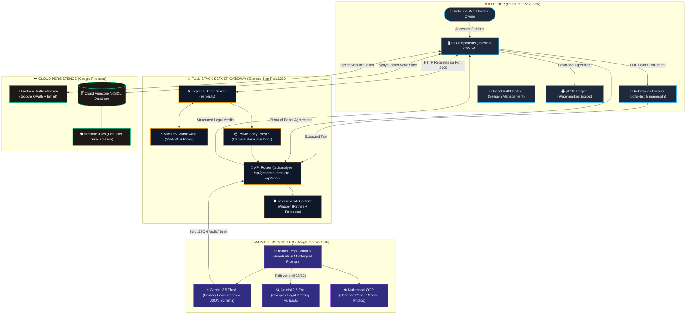
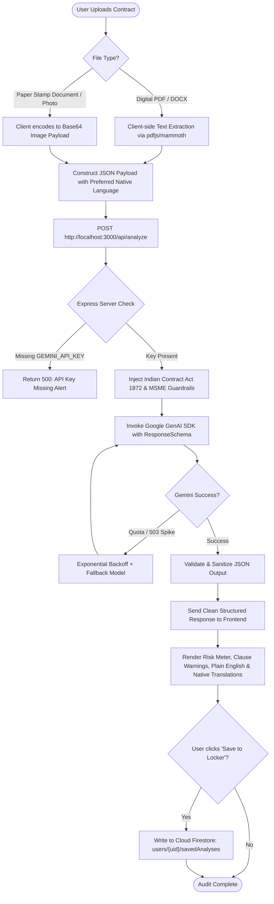
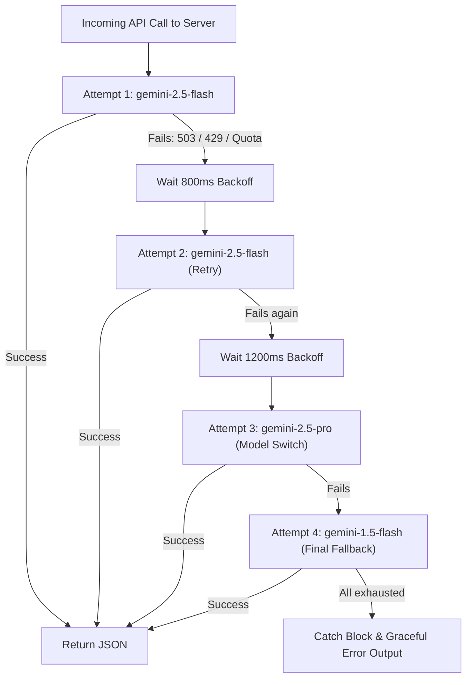

<div align="center">

# ⚖️ Namma NyayaMitra
### ನಮ್ಮ ನ್ಯಾಯಮಿತ್ರ &nbsp;•&nbsp; हमारा न्यायमित्र

**The Legal Shield for Indian MSMEs & Micro-Entrepreneurs**

Democratizing legal intelligence for kirana stores, micro-manufacturers, contractors, and small business owners across India.


</div>

---

## 📌 Table of Contents

1. [Overview](#-overview)
2. [Architecture Flowcharts](#️-architecture-flowcharts)
   - [Comprehensive Architecture](#1-comprehensive-architecture-flowchart)
   - [Full-Stack Data & Processing Flow](#2-full-stack-data--processing-flowchart)
   - [Resilient Multi-Model Failover Pipeline](#3-resilient-multi-model-failover-pipeline)
   - [Database & Security Flow](#4-database--security-flowchart)
3. [Visual Highlights & Modules](#-visual-highlights--modules)
4. [Key Features](#-key-features)
5. [Project Directory Structure](#-project-directory-structure)
6. [Supported Indian Legal Frameworks](#️-supported-indian-legal-frameworks)
7. [API Endpoints Reference](#-api-endpoints-reference)
8. [VS Code Setup & Running Guide](#-vs-code-complete-setup--running-guide)
9. [Troubleshooting FAQ](#-critical-troubleshooting-faq-in-vs-code)
10. [License & Disclaimer](#-license--disclaimer)

---

## 📖 Overview

In India, over **63 million MSMEs** face substantial operational and financial risk from complex legal contracts, opaque supplier agreements, delayed payments, and unaffordable legal counsel.

**Namma NyayaMitra** ("Our Legal Friend") bridges this justice gap with an end-to-end legal intelligence platform built specifically for Indian micro-entrepreneurs. Powered by **Google Gemini** and built with **React 19, Express, and Firebase**, it:

- 🗣️ Translates legal jargon into plain, actionable advice — in **Hindi, Kannada, Marathi, Tamil, Telugu, Gujarati, Bengali**, and more
- 🔍 Audits contracts for hidden risks and unfair clauses
- 📝 Generates enforceable, court-ready agreements
- 🚨 Provides 24/7 crisis guidance for legal emergencies

---

## 🏗️ Architecture Flowcharts

### 1. Comprehensive Architecture Flowchart

Full topology — user interactions, client-side extraction, the Express full-stack proxy gateway (Port 3000), Google Gemini LLM processing, and Firebase persistence.



### 2. Full-Stack Data & Processing Flowchart

Step-by-step data journey when an MSME owner submits an agreement for review.



### 3. Resilient Multi-Model Failover Pipeline



### 4. Database & Security Flowchart

```
Cloud Firestore (Native Mode)
└── users/{uid}
    ├── profileData: { businessType, turnover, state, nativeLanguage }
    │
    ├── savedAnalyses/{analysisId}
    │   ├── documentTitle: string
    │   ├── overallRiskScore: number (0-100)
    │   ├── overallVerdict: { english, hindi, native }
    │   ├── riskFlags: [ { clauseText, riskLevel, whatToDo } ]
    │   ├── clauseByClause: [ { clauseTitle, plainEnglish, verdict } ]
    │   └── createdAt: timestamp
    │
    └── savedContracts/{contractId}
        ├── documentType: string
        ├── documentTitle: string
        ├── formalDraft: string
        ├── plainEnglishSummary: string
        ├── nativeSummary: string
        └── createdAt: timestamp
```

> 🔒 **Security Invariant:** Enforced via `firestore.rules` where `request.auth.uid == userId`. No user can view, edit, or delete another business owner's contracts.

---

## 📸 Visual Highlights & Modules

| Module | Description |
|---|---|
| 📑 **Multilingual Document Analyzer** | Scan PDFs, DOCX, and photos of contracts for hidden traps & risk scores |
| ✍️ **Bilingual Contract Generator** | Draft legally enforceable agreements under the Indian Contract Act, 1872 |
| 🛡️ **Legal Rights & Schemes Portal** | Access MSME Samadhaan, Udyam, CGTMSE & Mudra loan roadmaps |
| 🚨 **Emergency Legal Crisis Assistance** | Immediate protocol for police extortion, illegal shop sealing & bounced cheques |

---

## ✨ Key Features

### AI Contract & Document Analyzer
- Detects unilateral termination clauses, unfair indemnities, hidden financial penalties, and unequal arbitration locations
- Calculates a numerical **Risk Score (0–100)** with clear safety verdicts
- Supports camera snaps of physical stamp papers with base64 OCR

### Bilingual Contract Generator
- Commercial Shop Lease Agreements (दुकान किराया / ಬಾಡಿಗೆ ಒಪ್ಪಂದ)
- Wholesale Goods Supply Agreements (माल आपूर्ति अनुबंध)
- Service & Freelance Contracts (सेवा अनुबंध)
- Court-ready legal English draft with parallel simplified regional translations
- Built-in watermark styling with direct PDF download

### Domain-Locked 24/7 AI Legal Chatbot
- Communicates in Hindi, Kannada, Marathi, Tamil, Telugu, Gujarati, and Bengali
- Strict guardrails — answers only MSME legal queries, rights, and contract disputes

### MSME Schemes & Rights Directory
- Guidance on MSME Samadhaan (mandatory 45-day delayed payment recovery with 3x compound interest)
- Zero-cost official Udyam registration guide
- Section 138 Negotiable Instruments Act notice generation for bounced cheques

### NyayaLocker Vault
- Secure personal legal dashboard with Firebase persistence

---

## 📂 Project Directory Structure

```
namma-nyayamitra/
├── .env.example              # Template environment configuration
├── firestore.rules           # Granular Firestore security rules
├── index.html                # App entry point
├── metadata.json             # Applet identity & permissions configuration
├── package.json               # NPM packages & build scripts
├── server.ts                 # Express full-stack API server & Gemini wrapper
├── tsconfig.json              # TypeScript compilation rules
├── vite.config.ts             # Vite configuration with Tailwind CSS v4 plugin
└── src/
    ├── App.tsx                 # Main container, routing, and navigation layout
    ├── index.css               # Global design system & theme focus styling
    ├── main.tsx                # DOM mount point & AuthContext provider
    ├── components/
    │   ├── FloatingChatbot.tsx   # 24/7 Multilingual legal AI chat assistant
    │   ├── Footer.tsx            # Legal disclaimer & statutory notice footer
    │   ├── Navbar.tsx            # Top navigation & language switcher (EN/HI/Both)
    │   └── Sidebar.tsx           # Responsive navigation drawer
    ├── context/
    │   └── AuthContext.tsx       # Firebase Auth provider & profile state
    ├── pages/
    │   ├── About.tsx              # Platform mission & legal methodology
    │   ├── Awareness.tsx          # MSME legal literacy & rights directory
    │   ├── Dashboard.tsx          # NyayaLocker personal vault & profile manager
    │   ├── DocumentAnalyzer.tsx   # Core AI risk audit & clause breakdown tool
    │   ├── EmergencyAssistance.tsx # Crisis response (sealing, extortion, police)
    │   ├── GovSchemes.tsx         # Government schemes, subsidies & Samadhaan portal
    │   ├── Home.tsx               # Landing page with interactive feature cards
    │   ├── Onboarding.tsx         # MSME business type & language onboarding
    │   └── TemplateGenerator.tsx  # Bilingual contract creation & PDF exporter
    ├── services/
    │   └── firebase.ts            # Firebase client initialization & Firestore helpers
    └── utils/
        └── pdfGenerator.ts         # jsPDF client-side contract styling & export
```

---

## ⚖️ Supported Indian Legal Frameworks

| Framework | Key Provisions |
|---|---|
| **The Indian Contract Act, 1872** | Essential elements of a valid contract (Offer, Acceptance, Consideration) • Section 23 (Lawful objects and consideration) • Sections 73 & 74 (Compensation for breach and liquidated damages) |
| **MSMED Act, 2006** | Sections 15 & 16 — mandatory payment within 45 days + compound interest penalty • Section 18 — reference to the Micro and Small Enterprises Facilitation Council (MSEFC) |
| **Negotiable Instruments Act, 1881** | Section 138 — statutory notice periods and remedies for dishonor of cheques |
| **The Transfer of Property Act, 1882** | Leases of immovable property, lock-in periods, security deposit return norms |

---

## 📡 API Endpoints Reference

| Method | Endpoint | Description | Payload Body |
|---|---|---|---|
| `GET` | `/api/health` | Health & uptime check | None |
| `POST` | `/api/analyze` | AI contract analysis, OCR & risk audit | `{ documentType, text, image, nativeLanguage }` |
| `POST` | `/api/generate-template` | Draft customized Indian business agreement | `{ documentType, formValues }` |
| `POST` | `/api/chat` | Domain-locked legal crisis and Q&A chat | `{ message, chatHistory, nativeLanguage, documentContext, chatType }` |

---

## 💻 VS Code Complete Setup & Running Guide

**Step 1 — Open the project in VS Code**
Launch VS Code → `File > Open Folder...` (`Ctrl+K Ctrl+O` on Windows/Linux, `Cmd+O` on macOS) → select the extracted `namma-nyayamitra` root directory.

**Step 2 — Open the integrated terminal**
Press `` Ctrl+` `` (Windows/Linux) or `` Cmd+` `` (macOS), or `Terminal > New Terminal`.

**Step 3 — Install required Node packages**
```bash
npm install
```
> Requires **Node.js v18+**. Check with `node -v`.

**Step 4 — Configure the `.env` file**
Create a `.env` file in the root folder (alongside `package.json`):
```env
# 1. Google Gemini API Key (Required for AI contract analysis and chat)
# Get a free key at: https://aistudio.google.com/app/apikey
GEMINI_API_KEY=your_actual_gemini_api_key_here

# 2. Firebase Configuration (Required for user authentication & NyayaLocker vault)
# Found under Firebase Console > Project Settings > General > Your Apps > Web app
VITE_FIREBASE_API_KEY=your_firebase_api_key
VITE_FIREBASE_AUTH_DOMAIN=your_project.firebaseapp.com
VITE_FIREBASE_PROJECT_ID=your_project_id
VITE_FIREBASE_STORAGE_BUCKET=your_project.appspot.com
VITE_FIREBASE_MESSAGING_SENDER_ID=your_sender_id
VITE_FIREBASE_APP_ID=your_app_id
```

**Step 5 — Start the full-stack application**
```bash
npm run dev
```
Console output:
```
Namma NyayaMitra Fullstack Server listening on http://0.0.0.0:3000
```
Open your browser and navigate to **http://localhost:3000**

---

## 🚨 Critical Troubleshooting FAQ in VS Code

<details>
<summary><strong>Q1: "Failed to execute 'json' on 'Response': Unexpected end of JSON input"</strong></summary>

**Root Cause:** You ran `npm run client` or raw `vite`, which launches the frontend on port `5173`. When you click "Analyze Document," the frontend calls `/api/analyze`, but there's no backend on `5173` to handle it.

**Fix:** Stop all processes (`Ctrl+C`) and run `npm run dev`. This executes `tsx server.ts` on port `3000`, powering both the Express API backend and Vite frontend together. Always access the app at `http://localhost:3000`.
</details>

<details>
<summary><strong>Q2: http://localhost:3000 shows "Site can't be reached"</strong></summary>

**Root Cause:** The Node Express server isn't actively running in your terminal.

**Fix:** In your VS Code terminal, confirm `npm run dev` is running without errors. If port 3000 is occupied, kill the process or restart VS Code.
</details>

<details>
<summary><strong>Q3: How do I test the backend health?</strong></summary>

Visit `http://localhost:3000/api/health`. A correctly configured server returns:
```json
{"status": "ok", "time": "..."}
```
</details>

**Recommended VS Code Extensions:**
- **Tailwind CSS IntelliSense** (Tailwind Labs) — autocompletes styling classes
- **ESLint & Prettier** — code consistency and syntax highlighting
- **Markdown Preview Mermaid Support** — previews all architecture diagrams above directly inside VS Code

---

## 📜 License & Disclaimer

> **Legal Disclaimer:** Namma NyayaMitra is an AI-driven legal literacy, review, and drafting assistance tool designed to inform and assist small business owners. It does **not** constitute formal legal counsel and does **not** create an attorney-client relationship. For high-stakes litigation or court filings, users should consult a certified Indian advocate.

Distributed under the **MIT License**.

<div align="center">

**Built with ❤️ for Indian MSMEs & Kirana Store Owners 🇮🇳**

</div>